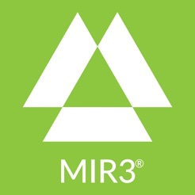

# MIR3

MIR3 is a notification and response software for business operations, including crisis management, IT service management, corporate communications, customer relations, supply chain management, event management, or any area that needs reliable two-way notification for groups from one to many thousands.
